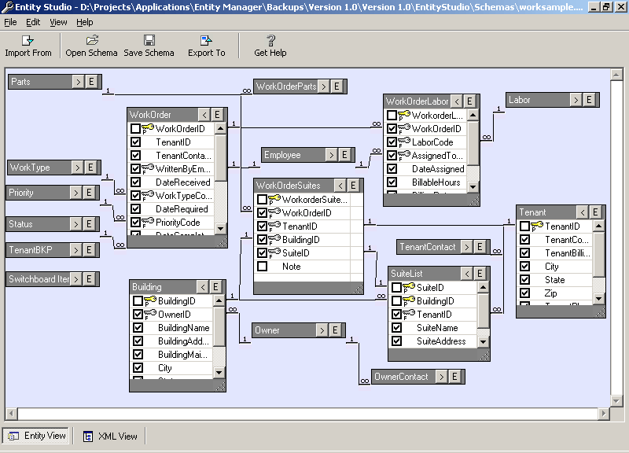



## CODE GENERATOR STUDIO :: Design Projects & Generate Code \- Also learn plugin architecture\.

### Description

Hello Guys, Need a true killer VB application that teaches you tonnes of programming techniques? Here is one. You can use this project to design entity relationship diagrams, to generate database and program code out of it. ER diagrams can be imported from databases and existing program code (classes). An Entity relationship diagram is something like a relationship diagram you see in Microsoft Access. This project provides (1) A small environment to work with ER diagrams, (2) an XML language and its DOM to describe these ER diagrams, and

(3) A control that can be used to visually represent these ER Diagrams. It supports code generation as well.

Presently, It can import ER diagrams from Access 97 database (using DAO) and Export code to ASP (with relational lookup combos for implementing relations).

Also, You can write your own plugins to import and export diagram/code from a variety of platforms. Download and see the readme file. Also visit project homepage at http://www.logicmatrixonline.com/estudio - I spend a lot of time on this, so vote please. Thanks, and enjoy coding.
 
### More Info
 

             |
---                |---
**Submitted On**   |2004-08-02 23:32:26
**By**             |[Anoop Madhusudanan](https://github.com/Planet-Source-Code/PSCIndex/blob/master/ByAuthor/anoop-madhusudanan.md)
**Level**          |Intermediate
**User Rating**    |4.9 (257 globes from 52 users)
**Compatibility**  |VB 6\.0, ASP \(Active Server Pages\) , VBA MS Access
**Category**       |[Complete Applications](https://github.com/Planet-Source-Code/PSCIndex/blob/master/ByCategory/complete-applications__1-27.md)
**World**          |[Visual Basic](https://github.com/Planet-Source-Code/PSCIndex/blob/master/ByWorld/visual-basic.md)
**Archive File**   |[Estudio177924872004\.zip](https://github.com/Planet-Source-Code/anoop-madhusudanan-code-generator-studio-design-projects-generate-code-also-learn-plugin-a__1-55425/archive/master.zip)

